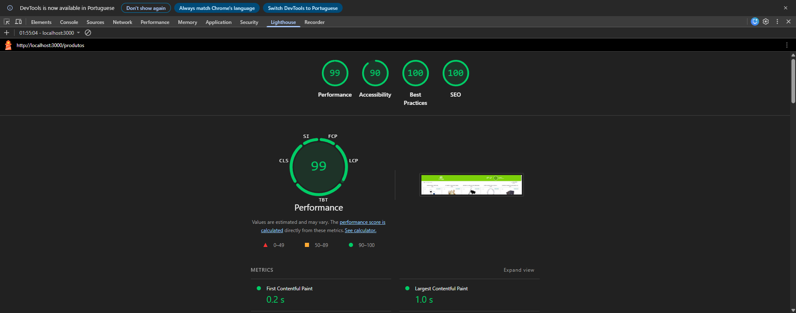

# 🚀 Innovation App

> Aplicação de teste técnico desenvolvida com **Next.js 15+** e **Tailwind CSS**, focada em performance, escalabilidade e experiência do usuário.

---

## 📋 Sobre o Projeto

Uma aplicação moderna e responsiva construída com as melhores práticas de desenvolvimento web. O projeto integra autenticação de usuários, gerenciamento de estado e componentes otimizados, tudo containerizado com Docker para facilitar o deployment.

---

## 🛠️ Stack Tecnológico

- **Next.js 15+** com App Router
- **TypeScript** para tipagem estática
- **Tailwind CSS** para estilização
- **Zustand** para controle de estado global
- **Docker** com multi-stage build
- **Node.js 20 (LTS)**
- **Jest** para testes
- **Playwright** para E2E tests

---

## 🚀 Como Executar

### Pré-requisitos
- Docker instalado em sua máquina

### Passos

**1. Build da imagem:**
```bash
docker build -t innovation-app .
```

**2. Execução do container:**
```bash
docker run -p 3000:3000 --name innovation-container innovation-app
```

**3. Acesso:**
Abra o navegador em [http://localhost:3000](http://localhost:3000)

> **Nota:** A rota principal redireciona automaticamente para `/login`.

---

## 💡 Decisões Técnicas

| Tecnologia | Justificativa |
|-----------|---------------|
| **Next.js (App Router)** | Facilita roteamento e otimização nativa de Server-Side Rendering (SSR) |
| **Docker Multi-stage Build** | Reduz o tamanho da imagem final, incluindo apenas o necessário para execução |
| **Node.js 20 (LTS)** | Compatibilidade total com Next.js e bibliotecas modernas |
| **Redirects (next.config)** | Garante que o login seja a porta de entrada da aplicação |
| **TypeScript** | Tipagem estática e prevenção de erros de interface |

---

## 📊 Performance

### Lighthouse (Desktop)

*O build foi realizado em modo de produção para garantir minificação de código.*

### Demonstração do Fluxo


---

## 📱 Conecte-se

<div align="center">

[](https://www.linkedin.com/in/rafael-cordeiro-de-almeida/)
[](https://github.com/RCordeiroAlmeida/)
[](mailto:rafaelcordeiro299@gmail.com)

</div>

---

<div align="center">

**Desenvolvido por Rafael — 2026**

</div>